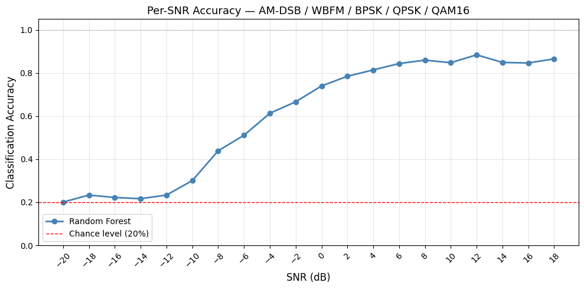
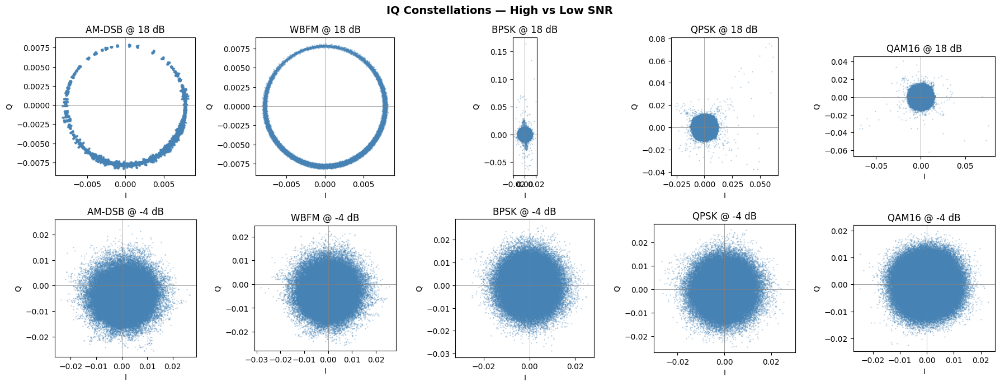
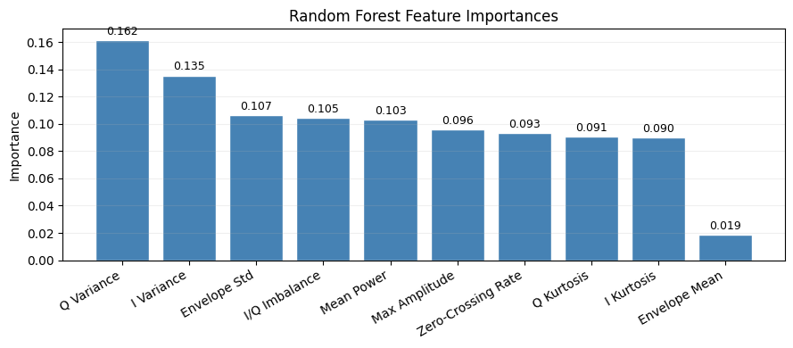
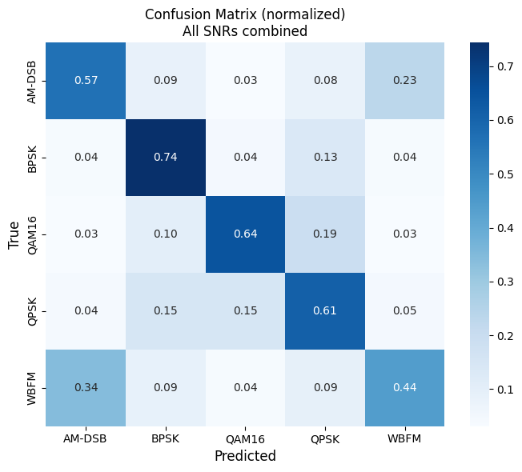
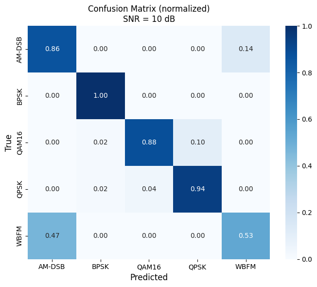

# Modulation Classifier — RadioML 2016.10a

A signal modulation classifier that distinguishes between **5 modulation types** using
hand-crafted IQ features and a Random Forest. Built on the RadioML 2016.10a dataset.
No deep learning required.



---

## Overview

Automatic modulation classification (AMC) is the task of identifying the modulation
scheme of a received radio signal without prior knowledge. This project implements a
traditional ML pipeline — feature extraction from raw IQ samples followed by a Random
Forest classifier — as a baseline for the AMC problem.

The 5 classes span two signal families:
- **Analog:** AM-DSB, WBFM
- **Digital:** BPSK, QPSK, QAM16

This cross-family design makes the confusion matrix more interpretable and mirrors
real-world classification scenarios where both analog and digital signals may be present.

---

## Dataset

**RadioML 2016.10a** — DeepSig / O'Shea et al.

| Property | Value |
|---|---|
| Total samples | 100,000 |
| Classes used | 5 of 11 |
| Samples per class | 20,000 |
| SNR range | −20 dB to +18 dB (20 levels) |
| Sample shape | (2, 128) — I and Q channels, 128 time steps |

Download: https://www.deepsig.ai/datasets (`RML2016.10a_dict.pkl`)

> **Gotcha:** The dataset values sit in the `±0.06` to `±0.16` amplitude range —
> much smaller than most tutorials assume. Hardcoded axis limits of `±1.5` will
> collapse all constellation plots into a single dot. Always use auto-scaling axes.

---

## IQ Constellations



Top row: high SNR (+18 dB) — signal structure is visible.
Bottom row: low SNR (−4 dB) — noise dominates, all classes smear into blobs.

---

## Approach

### Pipeline

```
Raw IQ samples (2, 128)
        ↓
Feature extraction (10 features per sample)
        ↓
Train/test split (80/20, stratified by class)
        ↓
Random Forest (100 trees, n_jobs=-1)
        ↓
Evaluation (per-SNR accuracy + confusion matrix)
```

### Why traditional ML over deep learning

- No PyTorch or TensorFlow dependency
- Trains in under 2 minutes on CPU
- Feature importances provide direct interpretability
- Strong baseline to compare against CNN approaches later

---

## Features

10 hand-crafted features extracted per sample, inspired by higher-order statistics
used in classical AMC literature:

| Rank | Feature | Importance | Purpose |
|---|---|---|---|
| 1 | Q Variance | 0.162 | Spread of Q channel |
| 2 | I Variance | 0.135 | Spread of I channel |
| 3 | Envelope Std | 0.107 | AM vs FM separation |
| 4 | I/Q Imbalance | 0.105 | Channel asymmetry |
| 5 | Mean Power | 0.103 | Overall signal energy |
| 6 | Max Amplitude | 0.096 | Peak envelope value |
| 7 | Zero-Crossing Rate | 0.093 | Oscillation frequency |
| 8 | Q Kurtosis | 0.091 | 4th-order moment |
| 9 | I Kurtosis | 0.090 | 4th-order moment |
| 10 | Envelope Mean | 0.019 | Average signal strength |



**Key finding:** Contrary to classical AMC theory where kurtosis dominates PSK/QAM
separation, I/Q variance ranked highest in this dataset. Features are relatively evenly
distributed (0.09–0.16 range), suggesting the Random Forest distributes decisions
across multiple features rather than relying on one dominant statistic. Envelope Mean
ranked last (0.019) and can be safely removed in future iterations.

---

## Results

### Overall accuracy: 60.1%

The overall number averages across all 20 SNR levels including −20 to −12 dB where
no classifier can do better than random (20% chance level). The per-SNR curve is the
correct evaluation metric.

### Per-SNR accuracy

| SNR Range | Accuracy | Notes |
|---|---|---|
| ≤ −12 dB | ~20% | At chance level — signal buried in noise |
| −10 to −4 dB | 30–61% | Sharp rise as envelope features activate |
| −2 to +4 dB | 67–81% | Digital classes begin separating |
| +6 to +18 dB | 85–89% | Plateau — remaining errors are QPSK↔QAM16 and AM-DSB↔WBFM |

### Confusion matrices



| SNR | AM-DSB | BPSK | QAM16 | QPSK | WBFM |
|---|---|---|---|---|---|
| All SNRs | 0.57 | 0.74 | 0.64 | 0.61 | 0.44 |
| 0 dB | 0.66 | 0.98 | 0.90 | 0.64 | 0.53 |
| +10 dB | 0.86 | **1.00** | 0.88 | 0.94 | 0.53 |
| −10 dB | 0.31 | 0.29 | 0.28 | 0.35 | 0.26 |



---

## Key Findings

**1. BPSK is the easiest class.**
Achieves perfect 1.00 accuracy at +10 dB. The two-point constellation is trivially
separable from all other classes at reasonable SNR.

**2. AM-DSB↔WBFM confusion is persistent.**
WBFM accuracy plateaus at ~53% even at +10 dB. In RadioML 2016.10a both classes
exhibit a ring-shaped IQ constellation due to the synthetic channel model, making
envelope std insufficient to separate them reliably. This is a known limitation of
hand-crafted features on this dataset — a CNN operating on raw IQ would likely
resolve this confusion by learning the subtle structural differences directly.

**3. QPSK↔QAM16 is the hardest digital pair.**
At 0 dB, QPSK is misclassified as QAM16 33% of the time. Their 4-point overlap
at low SNR makes kurtosis-based separation unreliable below +4 dB.

**4. The knee of the accuracy curve is around −10 dB.**
Below this point the classifier operates at chance. Above it, accuracy rises sharply
— useful operating range begins at approximately −8 dB.

---

## How to Run

**1. Clone the repo**
```bash
git clone https://github.com/saminsyam/modulation-classifier.git
cd modulation-classifier
```

**2. Install dependencies**
```bash
pip install numpy scikit-learn matplotlib seaborn
```

**3. Download the dataset**

Download `RML2016.10a_dict.pkl` from https://www.deepsig.ai/datasets and place it
in the project root, or update `DATASET_PATH` in the notebook to your file location.

**4. Run the notebook**

Open `modulation_classifier.ipynb` in Google Colab or Jupyter and run all cells in order.

---

## Project Structure

```
modulation-classifier/
├── ML_modulation_classifier.ipynb # main notebook
├── README.md                      # this file
├── per_snr_accuracy.png           # main result plot
├── constellations.png             # IQ constellation EDA
├── confusion_matrix_all.png       # confusion matrix — all SNRs
├── confusion_matrix_0dB.png       # confusion matrix — 0 dB
├── confusion_matrix_10dB.png      # confusion matrix — +10 dB
├── confusion_matrix_-10dB.png     # confusion matrix — −10 dB
└── feature_importances.png        # feature importance ranking
```

---

## What's Next

- **CNN baseline (VT-CNN2)** — same dataset, raw IQ input `(2, 128)`, PyTorch.
  Expected to resolve the AM-DSB↔WBFM confusion by learning features directly
- **ML vs CNN comparison** — overlay both per-SNR curves on one plot
- **RadioML 2018.01a** — 24 classes, more realistic channel effects, ResNet backbone
- **OTA capture** — deploy trained model on live signals captured with NooElec RTL-SDR V5
- **GPU inference** — export to ONNX/TensorRT for RTX 3080 deployment

---

## References

- O'Shea, T., Corgan, J., & Clancy, T. C. (2016). Convolutional radio modulation
  recognition networks. *arXiv:1602.04105*
- O'Shea, T., Roy, T., & Clancy, T. C. (2018). Over-the-air deep learning based
  radio signal classification. *arXiv:1712.04578*
- RadioML datasets: https://www.deepsig.ai/datasets

---

## Hardware

- **Dataset:** RadioML 2016.10a (synthetic, no hardware required for this project)
- **SDR:** NooElec RTL-SDR V5 (acquired — planned for OTA capture in next phase)
- **GPU:** NVIDIA RTX 3080 (planned for CNN training and TensorRT inference)
